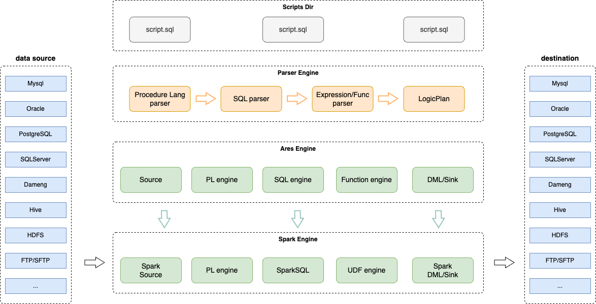

# Ares-Access

## 目录

- [概览](#概览)
- [快速开始](docs/zh/start/quick-start-ares.md)
- [安装](docs/zh/start/deployment.md)
- [PL-SQL语法](docs/zh/plsql/ares-plsql.md)
- [语法示例](#语法示例)

## 概览

Ares-Access 是基于 `PL-SQL` 语法的 ETL、跨源计算、数据分析、存计分离的数据计算集成引擎。



- 功能特性1：支持多种数据源连接，包括 `Mysql`, `Oracle`, `SQLServer`, `PostgreSQL`, `Hive`, `HDFS`, `FTP`, `SFTP` 等；
- 功能特性2：支持跨源计算，可以连接多个源端加载数据到Ares引擎并通过Spark进行分布式计算，最后将结果输出到目标端；
- 功能特性3：支持丰富的DML-SQL语法，包括：`INSERT`, `UPDATE`, `DELETE`, `MERGE`, `TRUNCATE`等（部分目标端仅支持`INSERT`）；
- 功能特性4：支持丰富的过程语法，包括：`CREATE PROCEDURE`, `CREATE FUNCION`, `IF`, `FOR`, `WHILE`, `CURSOR`,  `EXCEPTION`等，详细参见：[PL-SQL语法](docs/zh/plsql/ares-plsql.md)
- 功能特性5：支持丰富的数据类型：`INT`, `BIGINT`, `NUMBER`, `VARCHAR`, `DATE`, `TIMESTAMP` 等；
- 功能特性6：支持过程函数整合SQL-UDF：在过程语言中定义的`CREATE FUNCTION`可以直接在SQL中使用，并支持多种数据类型；

## 语法示例

### 语法示例1

```sql
SET datasource.mytest.connector=jdbc;
SET datasource.mytest.url=jdbc:mysql://127.0.0.1:3306/mytest?useSSL=false;
SET datasource.mytest.driver=com.mysql.cj.jdbc.Driver;
SET datasource.mytest.user=root;
SET datasource.mytest.password=123456;

CREATE TABLE test1
WITH (
    'datasource' = 'mytest',
    -- 'query'='select * from t_user',
    'table_name'='t_user',
    'type' = 'source,sink'
);

CREATE TABLE test2
WITH (
    'datasource' = 'mytest',
    'table_name'='t_user1',
    'type' = 'source,sink'
);

SELECT * FROM test1 LIMIT 20;

TRUNCATE TABLE test2;

INSERT INTO test2 (id, name, c_time) SELECT id, name, c_time FROM test1 WHERE id > 0 LIMIT 100;

UPDATE test2 a, test1 b SET a.name = b.name||'_', a.c_time = to_timestamp(date_add(b.c_time, 1)||' '||date_format(b.c_time, 'HH:mm:ss')) WHERE a.id = b.id;

DELETE FROM test2 a, (SELECT * FROM test1 WHERE id>3) b WHERE a.id = b.id;

MERGE INTO test2 tu2
USING (SELECT * FROM test1) tu
ON (tu2.id=tu.id)
WHEN NOT MATCHED THEN
    INSERT (tu2.id, tu2.name, tu2.c_time)
        VALUES (tu.id, tu.name, tu.c_time)
WHEN MATCHED THEN
    UPDATE SET tu2.name = tu.name, tu2.c_time = tu.c_time;

DECLARE
    cnt INT := 0;
BEGIN
    SELECT COUNT(*) INTO :cnt FROM test1;
    PUT_LINE('Total records: '||:cnt);
END;
```

### 语法示例2

```sql
CREATE FUNCTION test(num INT) RETURN INT AS
BEGIN
    RETURN num + 1;
END;

PUT_LINE(test(-1));

SELECT test(10) as test;
```
### 语法示例3

```sql
CREATE PROCEDURE test(p1 IN INT, p2 IN NUMBER) AS
    a VARCHAR := 'test';
    b INT := 1;
    c TIMESTAMP := '2021-01-01 12:23:34.567';
    d NUMBER(10, 2) := 1.124;
BEGIN
    PUT_LINE(d);
    WHILE b <= p1 LOOP
        PUT_LINE('Current index: '||b);
        IF b > 2 THEN
            PUT_LINE('Exit while loop!');
            EXIT;
        END IF;
        b := b + 1;
    END LOOP;
END;

CALL test(5, 3.14);


CREATE PROCEDURE test2(p1 IN INT, p2 IN NUMBER, p3 OUT VARCHAR) AS
BEGIN
    p3 := (p1 * p2) || '_';
END;

DECLARE
    v1 VARCHAR;
BEGIN
    test2(2, 3.14, v1);
    put_line('Result: '||v1);
END;
```

### 语法示例4

```sql
CREATE TABLE test1
WITH (
    'connector' = 'fake',
    'schema' = '{"fields":{"id":"bigint","name":"string","c_time":"timestamp"}}',
    'rows' = '[{"fields":[1, "Eric", "2021-01-01 12:23:34"]},
               {"fields":[2, "Andy", "2022-03-11 11:23:34"]},
               {"fields":[3, "Joker", "2024-11-04 10:23:34"]}]',
    'type' = 'source'
);

DECLARE
    i INT := 0;
    e INT := 5;
BEGIN
    WHILE i < 5 LOOP
        IF i > 2 THEN
            EXIT;
        END IF;
        PUT_LINE('INDEX: ' || i);
        i := i + 1;
    END LOOP;

    FOR j IN 1..e LOOP
        IF j = 3 THEN
            EXIT;
        END IF;
        PUT_LINE('INDEX: ' || j);
    END LOOP;

    FOR cur IN (select * from test1) LOOP
        println(cur.id||' '||cur.name||' '||cur.c_time);
    END LOOP;
END;
```

## 执行示例

Local:
``` bash
./bin/ares-local-starter.sh --sql /path/to/sample.sql 
``` 

Spark3:
``` bash
./bin/start-ares-spark3-connector.sh --sql /path/to/sample.sql --master spark://127.0.0.1:7077 
``` 

Spark2:
``` bash
./bin/start-ares-spark2-connector.sh --sql /path/to/sample.sql --master spark://127.0.0.1:7077 
``` 