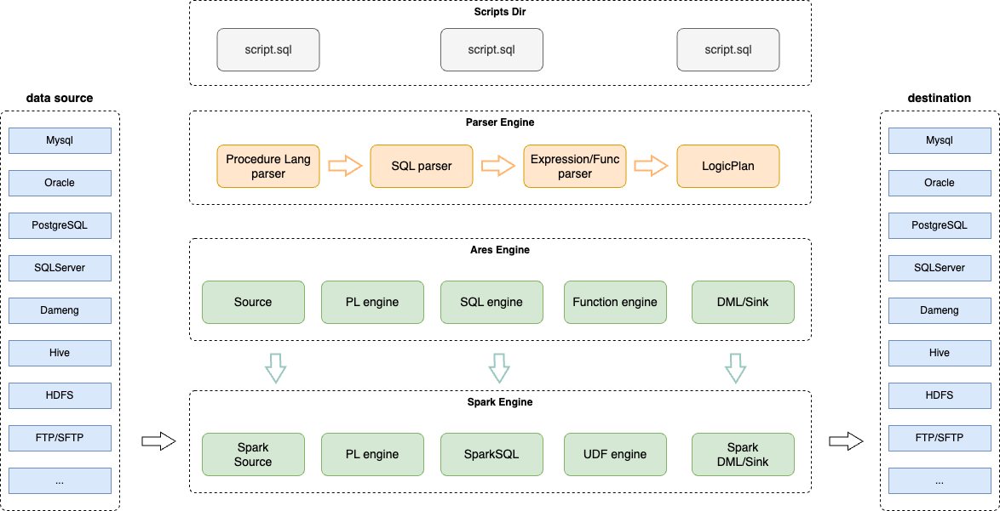

# Ares-Access

## 目录

- [概览](#概览)
- [快速开始](docs/zh/start/quick-start-ares.md)
- [安装](docs/zh/start/deployment.md)
- [PL-SQL语法](docs/zh/plsql/ares-plsql.md)
- [语法示例](#语法示例)

## 概览

Ares-Access 是基于 `PL-SQL` 语法的 ETL、跨源计算、数据分析、存计分离的数据计算集成引擎。



- 功能特性1：支持多种数据源连接，包括 `Mysql`, `Oracle`, `SQLServer`, `PostgreSQL`, `Dameng`, `Kingbase`, `OceanBase`, `OpenGauss`, `HDFS`, `FTP`, `SFTP`, `Paimon` 等；Hive 表通过 Spark 集群已整合的 Hive Catalog 访问，支持 `USING hive` 引用已有表，也支持 Hive 原生 `CREATE TABLE` 建表；Paimon 的 hive catalog 和 filesystem 都可以引用已有表，也可以用 `CREATE TABLE ... USING paimon` 建表；filesystem 通过 `warehouse` 接入，并可以配置 HDFS；
- 功能特性2：支持跨源计算，可以连接多个源端加载数据到Ares引擎并通过Spark进行分布式计算，最后将结果输出到目标端；
- 功能特性3：支持丰富的DML-SQL语法，包括：`INSERT`, `UPDATE`, `DELETE`, `MERGE`, `TRUNCATE`等（部分目标端仅支持`INSERT`）；
- 功能特性4：支持过程语法，包括：`def`、`if`、`for`、`while`、游标、`try/catch`，详细参见：[PL-SQL语法](docs/zh/plsql/ares-plsql.md)
- 功能特性5：支持丰富的数据类型：`INT`, `BIGINT`, `NUMBER`, `VARCHAR`, `DATE`, `TIMESTAMP` 等；

## 语法示例

### 语法示例1

```sql
SET datasource.mytest.connector=mysql;
SET datasource.mytest.url='jdbc:mysql://127.0.0.1:3306/mytest?useSSL=false';
SET datasource.mytest.driver=com.mysql.cj.jdbc.Driver;
SET datasource.mytest.user=root;
SET datasource.mytest.password=123456;

CREATE TABLE test1
USING mysql
OPTIONS (
    'datasource' = 'mytest',
    -- 'query'='select * from t_user',
    'table_name'='t_user',
    'type' = 'source,sink'
);

CREATE TABLE test2
USING mysql
OPTIONS (
    'datasource' = 'mytest',
    'table_name'='t_user1',
    'type' = 'source,sink'
);

SELECT * FROM test1 LIMIT 20;

TRUNCATE TABLE test2;

INSERT INTO test2 (id, name, c_time) SELECT id, name, c_time FROM test1 WHERE id > 0 LIMIT 100;

UPDATE test2 a, test1 b SET a.name = b.name || '_', a.c_time = to_timestamp(date_add(b.c_time, 1) || ' ' || date_format(b.c_time, 'HH:mm:ss')) WHERE a.id = b.id;

DELETE FROM test2 a, (SELECT * FROM test1 WHERE id>3) b WHERE a.id = b.id;

MERGE INTO test2 tu2
USING (SELECT * FROM test1) tu
ON (tu2.id=tu.id)
WHEN NOT MATCHED THEN
    INSERT (tu2.id, tu2.name, tu2.c_time)
        VALUES (tu.id, tu.name, tu.c_time)
WHEN MATCHED THEN
    UPDATE SET tu2.name = tu.name, tu2.c_time = tu.c_time;

def cnt = 0;
SELECT COUNT(*) INTO :cnt FROM test1;
PUT_LINE('Total records: ' || cnt);
```

### 语法示例2

```sql
def num = -1;
PUT_LINE(num + 1);

SELECT 10 + 1 as test;
```
### 语法示例3

```sql
def p1 = 5;
def p2 = 3.14;
def a = 'test';
def b = 1;
def c = '2021-01-01 12:23:34.567';
def d = 1.124;
PUT_LINE(d);
while b <= p1
    PUT_LINE('Current index: ' || b);
    if b > 2
        PUT_LINE('Break while loop!');
        break;
    end
    b = b + 1;
end

p1 = 2;
p2 = 3.14;
def v1 = (p1 * p2) || '_';
put_line('Result: ' || v1);
```

### 语法示例4

```sql
CREATE TABLE test1
USING fake
OPTIONS (
    'schema' = '{"fields":{"id":"bigint","name":"string","c_time":"timestamp"}}',
    'rows' = '[{"fields":[1, "Eric", "2021-01-01 12:23:34"]},
               {"fields":[2, "Andy", "2022-03-11 11:23:34"]},
               {"fields":[3, "Joker", "2024-11-04 10:23:34"]}]',
    'type' = 'source'
);

def i = 0;
def e = 5;
while i < 5
    if i > 2
        break;
    end
    PUT_LINE('INDEX: ' || i);
    i = i + 1;
end

for j in 1 .. e
    if j = 3
        break;
    end
    PUT_LINE('INDEX: ' || j);
end

for cur in (select * from test1)
    println(cur.id || ' ' || cur.name || ' ' || cur.c_time);
end
```

## 执行示例

Local:
``` bash
./bin/ares-local-starter.sh --sql /path/to/sample.sql 
``` 

Spark3:
``` bash
./bin/start-ares-spark3-connector.sh --sql /path/to/sample.sql --master spark://127.0.0.1:7077 
``` 

Spark2:
``` bash
./bin/start-ares-spark2-connector.sh --sql /path/to/sample.sql --master spark://127.0.0.1:7077 
``` 
